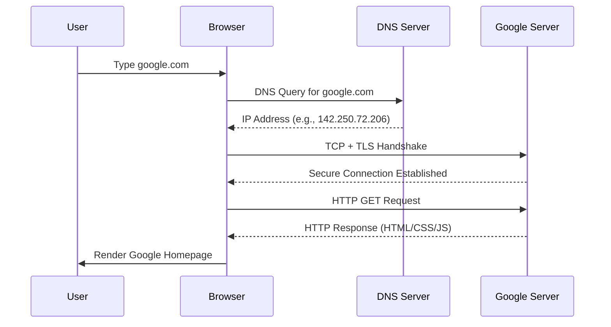

# 🌐 What Happens When You Type `google.com` in a Browser?

---

## 📌 Overview
Typing `google.com` into your browser’s address bar seems simple, but behind the scenes, **multiple systems, protocols, and processes** work together to fetch and display the web page.  

This README explains the **step-by-step breakdown** of what happens — from **keyboard input** to **webpage rendering**.  

---

## ⚙️ Step-by-Step Process

### 1️⃣ Keyboard Input & Browser Processing
- User types `google.com` into the browser’s address bar.  
- Browser interprets the input → decides whether it’s a **search query** or a **URL**.  
- In this case, `google.com` is recognized as a **URL**.  

---

### 2️⃣ URL Parsing
The browser breaks down the URL into components:  
- **Protocol**: `https://` (default if not typed explicitly).  
- **Domain**: `google.com`.  
- **Path**: `/` (default homepage).  

So the full request becomes:  
```
https://google.com/
```

---

### 3️⃣ DNS Resolution (Domain → IP)
Browsers need an **IP address** to contact Google servers. Steps:  
1. Browser checks **cache** (local DNS cache).  
2. If not found, OS resolver asks **DNS servers** (via ISP or configured DNS like 8.8.8.8).  
3. DNS Query process:  
   - Root DNS → `.com` TLD server → `google.com` authoritative DNS server.  
   - Returns IP (e.g., `142.250.72.206`).  

---

### 4️⃣ TCP Connection
- Browser initiates a **TCP handshake** with Google’s server IP on port **443** (HTTPS).  
- 3-way handshake:  
  1. Client → SYN  
  2. Server → SYN-ACK  
  3. Client → ACK  

Now a reliable TCP connection is established.  

---

### 5️⃣ TLS Handshake (HTTPS)
Since the connection is secure:  
- Browser and server exchange **TLS certificates**.  
- Browser verifies Google’s SSL certificate via **Certificate Authority (CA)**.  
- Session keys are generated for **encryption**.  

✅ Now communication is secure.  

---

### 6️⃣ HTTP Request
Browser sends:  
```http
GET / HTTP/1.1
Host: google.com
User-Agent: Chrome/139.0
Accept: text/html
```

This tells Google’s server → “Send me the homepage.” 

---

### 7️⃣ Server Processing
- Google’s web server receives the request.  
- It may pass through:  
  - **Load balancers** → to distribute traffic.  
  - **Caching layers** → to serve content faster.  
  - **Application servers** → to build dynamic content.  

Response is prepared.  

---

### 8️⃣ HTTP Response
Server responds with:  
```http
HTTP/1.1 200 OK
Content-Type: text/html
Content-Length: 14235
```

And then sends the **HTML, CSS, JavaScript, and media** that make up the Google homepage.  

---

### 9️⃣ Browser Rendering Engine
The browser’s **rendering engine** (e.g., Blink in Chrome) processes the content:  
1. **Parse HTML** → build **DOM tree**.  
2. **Parse CSS** → build **CSSOM tree**.  
3. Combine → **Render tree**.  
4. **Layout** → calculate position and size of elements.  
5. **Painting** → draw pixels on the screen.  
6. **JavaScript Execution** → runs scripts that modify DOM.  

---

### 🔟 Final Page Display
- Browser displays the **Google homepage**.  
- Any external resources (fonts, images, scripts) are fetched in parallel.  
- If you interact (e.g., type a search query), the cycle repeats with new requests.  

---

## 📚 Example Flow Summary

```
User Input → URL Parsing → DNS Lookup → TCP Handshake → TLS Handshake 
→ HTTP Request → Server Processing → HTTP Response → Browser Rendering → Page Display
```

---

## 📊 Visual Flow (Mermaid Diagram)



---

## ⚠️ Key Concepts Involved
- **DNS** → Translates domain name to IP.  
- **TCP/IP** → Reliable communication protocol.  
- **TLS/SSL** → Encryption & authentication.  
- **HTTP/HTTPS** → Web request/response protocol.  
- **Rendering Engine** → Converts code to visual output.  

---

## 🛡️ Security Considerations
- **Certificate validation** ensures you’re connecting to real Google, not a fake site.  
- **HTTPS encryption** prevents eavesdropping.  
- **Same-Origin Policy** protects against malicious scripts.  

---

## 🔗 Resources
- 🌍 [How DNS Works (Cloudflare)](https://www.cloudflare.com/learning/dns/what-is-dns/)  
- 📖 [How Browsers Work (HTML5 Rocks)](https://www.html5rocks.com/en/tutorials/internals/howbrowserswork/)  
- 🔐 [TLS Handshake Explained](https://www.cloudflare.com/learning/ssl/what-happens-in-a-tls-handshake/)  

---

## 📝 Summary
- Typing `google.com` triggers a chain of **networking and browser processes**.  
- It involves **DNS lookup, TCP/TLS handshakes, HTTP requests, server response, and rendering**.  
- The end result → **Google homepage loads securely and quickly**.  