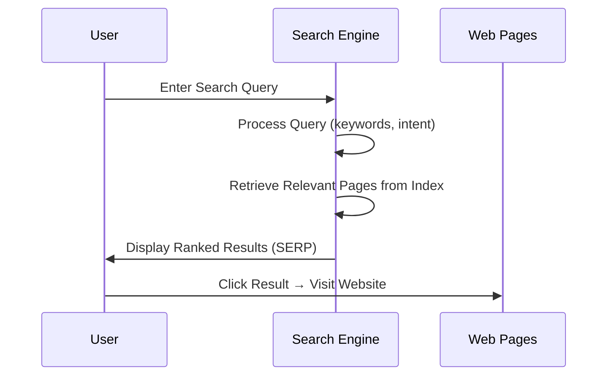

# 🌐 How Search Engines Work

---

## 📌 Overview
Search engines (like Google, Bing, and DuckDuckGo) help users find relevant information on the internet.  
Behind the simple search box lies a **complex system** that crawls, indexes, ranks, and retrieves web pages.  

This README explains the **step-by-step process** of how search engines work.  

---

## ⚙️ Step-by-Step Process

### 1️⃣ Crawling
- Search engines use **bots/spiders/crawlers** to browse the internet.  
- Crawlers follow **links** from one page to another.  
- They collect **raw data** such as page content, metadata, and URLs.  

---

### 2️⃣ Indexing
- Collected pages are processed and stored in a **search index**.  
- Index contains **keywords, content type, URL, metadata, and ranking signals**.  
- This allows the search engine to quickly retrieve results during a query.  

---

### 3️⃣ Processing Search Queries
- When a user types a query, the search engine interprets it:  
  - Detects **keywords**.  
  - Understands **user intent** using AI/NLP.  
  - Applies **language and location** context.  

---

### 4️⃣ Ranking
- The search engine ranks pages based on **relevance and authority**.  
- Common factors:  
  - Keyword matches  
  - Backlinks (quality and quantity)  
  - Content quality and freshness  
  - Page speed and mobile-friendliness  
  - User engagement metrics  

---

### 5️⃣ Retrieving Results
- The engine fetches the **most relevant pages** from its index.  
- Results are sorted based on ranking signals.  
- Typically displays **10 organic results** per page plus ads, snippets, or knowledge panels.  

---

### 6️⃣ Displaying Results
- Search results page (SERP) shows:  
  - Title  
  - URL  
  - Meta description  
  - Rich features (images, videos, maps, etc.)  
- Users click results, sending traffic to the respective websites.  

---

## 📚 Example Flow Summary

```
Crawling → Indexing → Query Processing → Ranking → Retrieval → Display
```

---

## 📊 Visual Flow (Mermaid Diagram)



---

## ⚠️ Key Concepts
- **Crawler/Bot** → Automatically scans web pages.  
- **Index** → Database of all crawled content.  
- **Ranking Algorithm** → Determines which pages appear first.  
- **SERP** → Search Engine Results Page.  

---

## 🛡️ Security & Privacy
- Some search engines block **malicious websites** from appearing.  
- HTTPS and site security influence ranking.  
- Privacy-focused engines (like DuckDuckGo) **don’t track users**.  

---

## 🔗 Resources
- 🌍 [How Search Engines Work (Google)](https://developers.google.com/search/docs/fundamentals/how-search-works)  
- 📖 [SEO Basics (Moz)](https://moz.com/beginners-guide-to-seo)  
- 🔐 [Search Engine Algorithms (Search Engine Land)](https://searchengineland.com/library/google/google-algorithm-updates)  

---

## 📝 Summary
- Search engines crawl, index, rank, and retrieve pages.  
- They aim to provide **fast, relevant, and secure results** to user queries.  
- Understanding this process helps in **SEO, web development, and cybersecurity awareness**.  

---